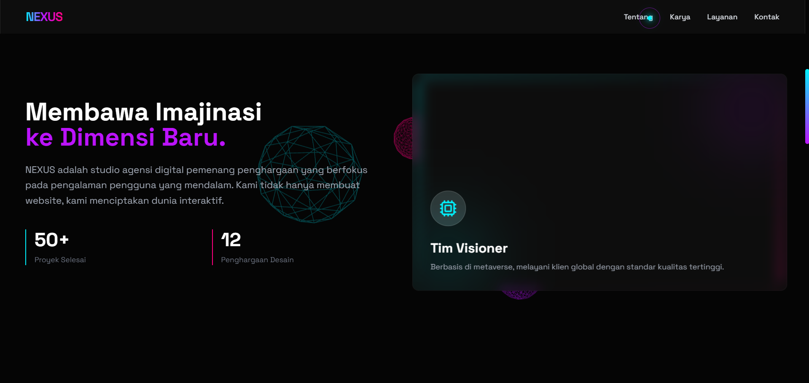
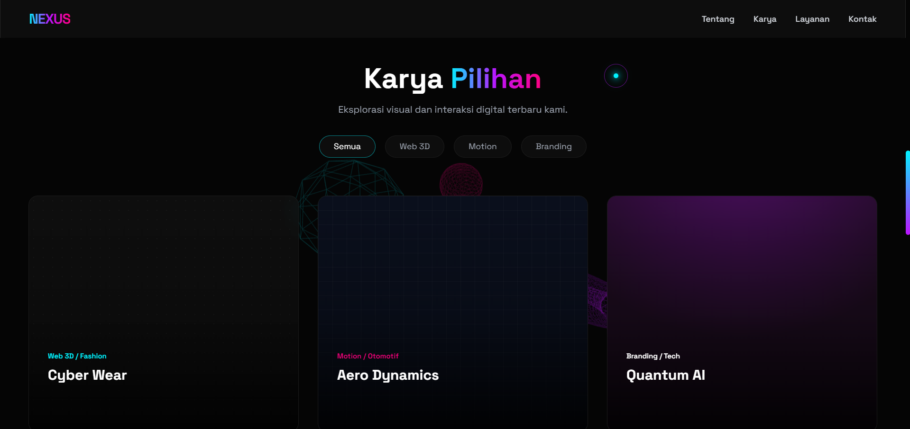
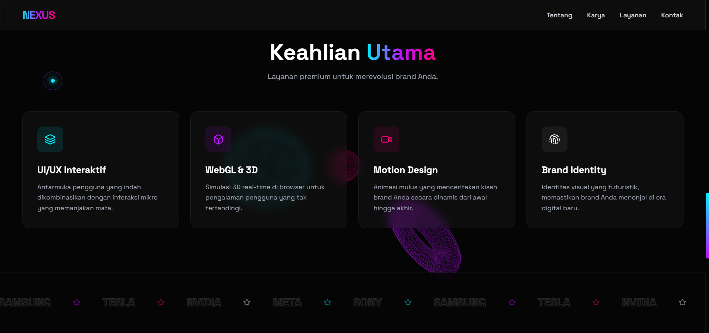

# NEXUS — 3D Creative Studio Landing Page

Single-file landing page untuk portofolio/agency dengan tampilan futuristik, animasi interaksi, dan background 3D berbasis Three.js.

## Live

https://nadhifxfx.github.io/Web-Nexus/

## Preview

> Taruh 4 gambar screenshot yang kamu kirim ke folder `assets/` dengan nama file berikut agar preview tampil di GitHub.
>
> - `assets/preview-1.png`
> - `assets/preview-2.png`
> - `assets/preview-3.png`
> - `assets/preview-4.png`

## Tech Stack

- Tailwind CSS (CDN)
- Three.js (WebGL background)
- Lucide Icons
- Google Fonts: Space Grotesk

## Struktur

- `index.html` — halaman utama (GitHub Pages membutuhkan file ini di root)
- `assets/` — gambar preview untuk README
